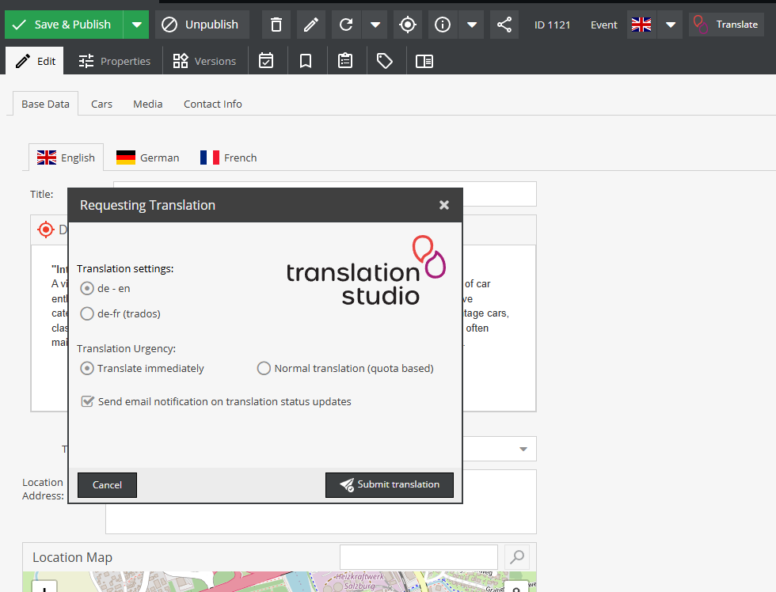

# How to use translationstudio

translationstudio is designed to be simple to use. Once installed and configured, you will find a `Translate` button at the top right corner of your content section.

Cllicking on this button allows you to choose the appropriate translation setting from the translationstudio extension and submit the content for translation.

Depending on your translation settings, you may find additional translation options available. All AI translations will be processed immediately, but with translation management software, you may provide additional information, set a deadline and choose if this translation request is to be processed immediately or if its submission should wait until certain quota settings are met (these are configured with your translationstudio account).

That's it.