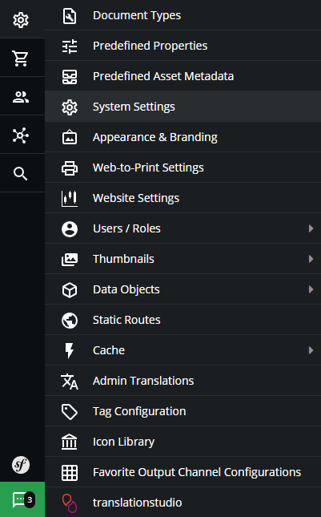
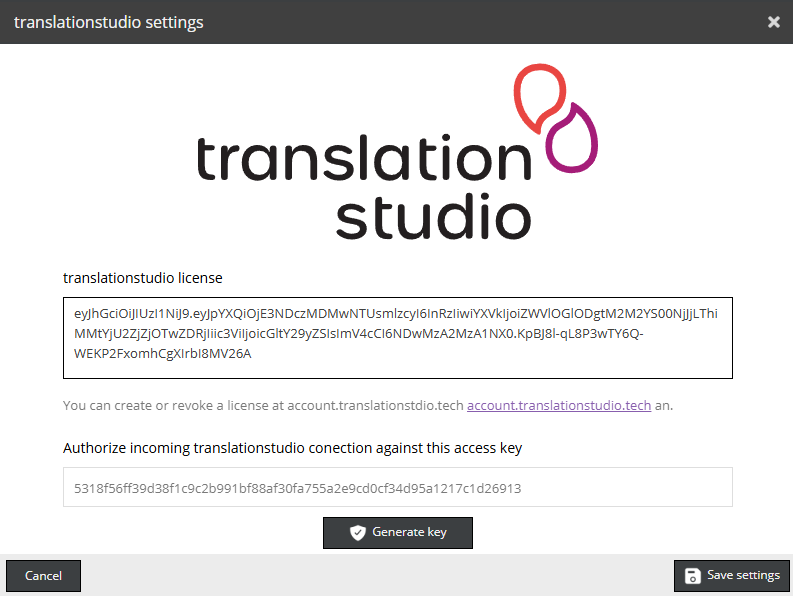

# Installing translationstudio

> [!NOTE]
> You need to create a [translationstudio.tech](https://translationstudio.tech) license to configure this extension.

## Requirements

Before you begin, make sure the following requirements are met:

-   A running Pimcore project
    Official Pimcore dokcumentation: (https://docs.pimcore.com/platform/Pimcore/Getting_Started/)

-   The translationstudio Bundle package (provided as a folder)

> [!NOTE]
> This installation instruction assumes that your pimcore instance if located at `/opt/pimcore` 

## Installation Steps

Enter your pimcore directory at `/opt/pimcore`.

### 1. Add the Bundle to Your Project
Place the translationstudio bundle folder inside the `./bundles` directory of your Pimcore project.

If the `./bundles` directory does not exist, create it. Make sure the folder permissions are set correctly.

## 2. Register the Bundle
Edit `./config/bundles.php` and register the bundle by adding the following code (if you use other bundles as well, please merge it accordingly):

```php
use Idmedia\TranslationstudioBundle\IdmediaTranslationstudioBundle;

return [
   IdmediaTranslationstudioBundle::class => ['all' => true],
];
```

For example, a configuration file containing several bundles might look like this:

```php
<?php

use Pimcore\Bundle\BundleGeneratorBundle\PimcoreBundleGeneratorBundle;
use Idmedia\TranslationstudioBundle\IdmediaTranslationstudioBundle;

return [
    PimcoreBundleGeneratorBundle::class => ['all' => true],
    IdmediaTranslationstudioBundle::class => ['all' => true],
];
```

### 3. Configure Bundle Search Path
Edit `./config/config.yaml` and add the following Pimcore bundle path:

```yml
pimcore:
   bundles:
      search_paths:
         - bundles/Idmedia/TranslationstudioBundle
```

### 4. Register Autoloading
Edit `./composer.json`, add the translationstudio bundle namespace at `autoload.psr-4`:

```js
{
   ...
   
   "autoload": {
      "psr-4": {

         ... 

         "Idmedia\\TranslationstudioBundle\\": "bundles/Idmedia/TranslationstudioBundle/src"

         ...
      }
   }

   ...
}
```

### 5. Dump Composer Autoload
Run the following command to update Composer's autoload files:

```
$ cd ./
$ composer dump-autoload
```

> [!NOTE]
> If the `composer` command cannot be found, you need to install it using your package manager.


### 6. Install Bundle Assets
Run the following command to install the bundle’s assets:

```
$ cd ./
$ bin/console assets:install
```

### Final Check
Open your Pimcore Admin Panel (e.g. `localhost/admin`) and navigate to the "Settings" tab. 

Scroll down to find the "translationstudio" section.



Clicking on it should open translationstudio settings.



If you see the translationstudio interface, the installation was successful! 
